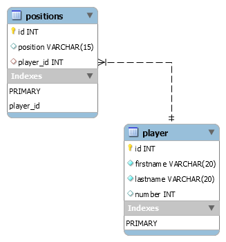

# baseballrosterjpa
Spring Boot REST API for the baseball roster including all CRUD operations

## Requirements

1. Java - 1.11.x

2. Maven - 3.x.x

3. MySQL - 8.x.x

## MySQL 

The project schema

The SQL script for creating the schema in a local MySQL DB can be found in the attachments folder.

